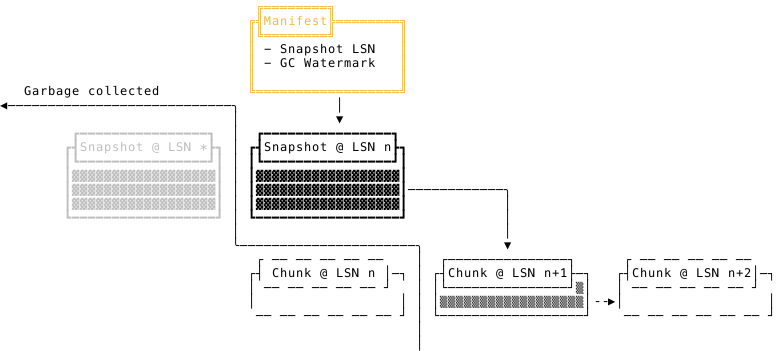

**OSWALD (Object Storage Write-Ahead Log Device)** is a [Write-Ahead Log][wal]
(WAL) design built exclusively on [object storage][object-storage] primitives.
It works with any object storage service that provides _read-after-write
consistency_ and _compare-and-swap_ operations, including AWS S3, Google Cloud
Storage, and Azure Blob Storage.

The design supports checkpointing and garbage collection, making it suitable for
[State Machine Replication][smr] (SMR).

See [nvartolomei.com/oswald](https://nvartolomei.com/oswald/) for more details.

[object-storage]: https://en.wikipedia.org/wiki/Object_storage
[smr]: https://en.wikipedia.org/wiki/State_machine_replication
[wal]: https://en.wikipedia.org/wiki/Write-ahead_logging
